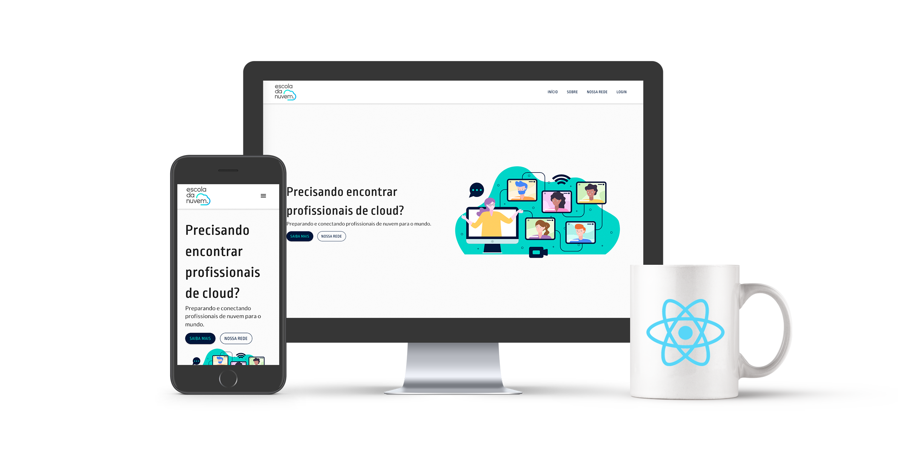

<h1 align="center">

</h1>

<h2 align="center">
Portal Escola da Nuvem
</h2>

 <a href="#dizzy-roadmap">Roadmap</a> •
 <a href="#wrench-tecnologias">Tecnologias</a> •
 <a href="#computer-desenvolvendo">Desenvolvendo</a> • 
 <a href="#magright-testes">Testes</a> • 
 <a href="#cloud-implantando">Implantando</a> • 
 <a href="#scroll-licença">Licença</a>

  

A Escola da Nuvem é uma organização não governamental (ONG) que prepara estudantes para carreiras na nuvem e os conecta a empregadores em potencial. Não é necessário ter experiência em tecnologia para se inscrever. Os cursos e o uso da plataforma é gratuito para alunos e alunas.

## :dizzy: Roadmap

TBD

## :wrench: Tecnologias

Para executar a aplicação os pré-requisitos são:

* NodeJS 15.3; 
* ReactJS 17.0; 
* TypeScript; 
* Git; 

## :computer: Desenvolvendo

1. Clone este repositório:

 `git clone https://github.com/escoladanuvem/edn-web-frontend.git`

2. Abra o projeto em sua IDE preferida;
3. Instale as dependências do projeto executando:

 `npm install`

4. Inicie a aplicação:

 `npm start`

## :mag_right: Testes

TBD

## :cloud: Implantando

TBD

## :heart: Contribuindo

Veja o arquivo [CONTRIBUTING](/CONTRIBUTING.md) para mais informaões.

### Contribuidores:

<table>
  <tr>
<td align="center"><a href="https://github.com/gabrielmartinigit"> <b>Gabriel Martini</b></a> </td>
  </tr>
</table>

## :scroll: Licença

Este projeto está licenciado sob a GNU General Public License v3.0 ou posterior.
Veja o arquivo [LICENSE](/LICENSE).

---

Feito com ♥ por Escola da Nuvem :wave: [Participe da nossa comunidade!]()
